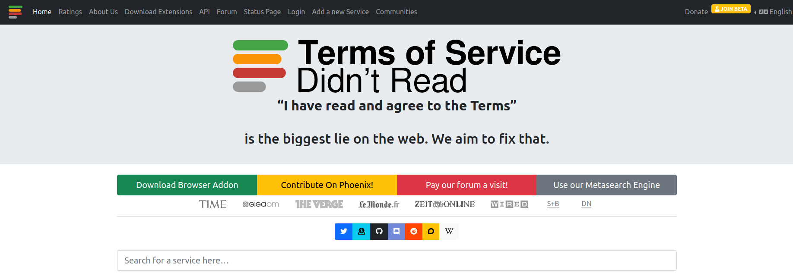

## `tosdr`

#### **“I have read and agree to the Terms”**

is the biggest lie on the web. We aim to fix that.

“Terms of Service; Didn't Read” (short: ToS;DR) is a young project
started in June 2012 to help fix the “biggest lie on the web”: almost no
one really reads the terms of service we agree to all the time.
