# WHAT??!!

Did you guys understand the title?

If **YES**, congrats! give yourself a pat on the back!

If **NO**, which cave did you crawl out from? Go back to your cave!

But since I'm in a good mood, I'll explain it nevertheless.

[Touching grass / touch grass](http://touch-grass.urbanup.com/15738647) is a figure of speech describing an action of going outside or to go outside. YES, you read that correctly. It's just another way of saying someone to go outside, especially to people who never leave their home.

And unfortunately, I've heard from some people that they perceive me as someone who does not go outside a lot. I mean, I don't blame them, that may even be true or is it ?

# Get to the point!
Some of my colleagues were planning to go on a trek to a nearby hill on a weekend just for fun. And by nearby I mean ~150kms. They just asked me whether I'd come or not during the coffee break. I just said yes without really giving it a second thought.

So the weekend came, we got some snacks, packed the required things and started travelling at approximately 00:00 on a Sunday (16th March). We boarded a bus at the Bus stand and started our travel towards a major nearby city called [Tiruvannamalai](https://en.wikipedia.org/wiki/Tiruvannamalai). We arrived there at around 3:10 in the very early morning.

But our bus (yes, another one!) to the nearby village that sits at the foothill arrives only at 4:30 in the bus stand, so we had some spare time.

# walking around..
If you already know or have looked at what's Tiruvannamalai's about, you'd already know that it is famous for temples! Lots of people all around Southern India come here for the temples.

And we did just that!

We walked from the bus stand to the temple. It took us like 10-15 mins. We did not go inside since there is always some small crowd even during these hours!
We just stayed outside, took a look at the temple and went back to the bus stand and waited there for some time for the bus that we wanted to catch to arrive.

Here are some pics I took.

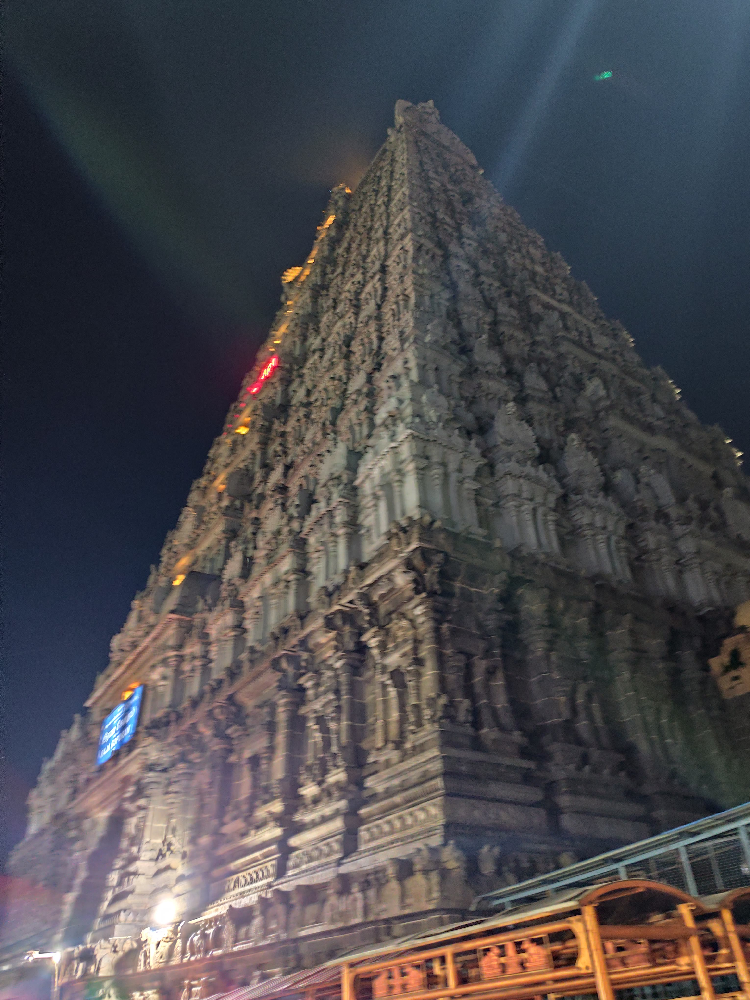 

It's very hard to describe through pictures how majestic and large it was. 

And I'm warning you now, this will be the case for more pictures coming forward.

Our bus finally arrive, and oh boy, it was extremely crowded. I had to cling onto a bar half asleep standing. We had to travel ~20 kms to reach the foothill village. And I was standing the entire duration until I got down from the bus.

Now, Listen.... When I told this bus will take us to the foothill of the village, I was lying! We have to wait for another bus which takes us to another village located near the foothill.

In the meantime, we found a small coffee/tea shop very nearby and we had a short break.

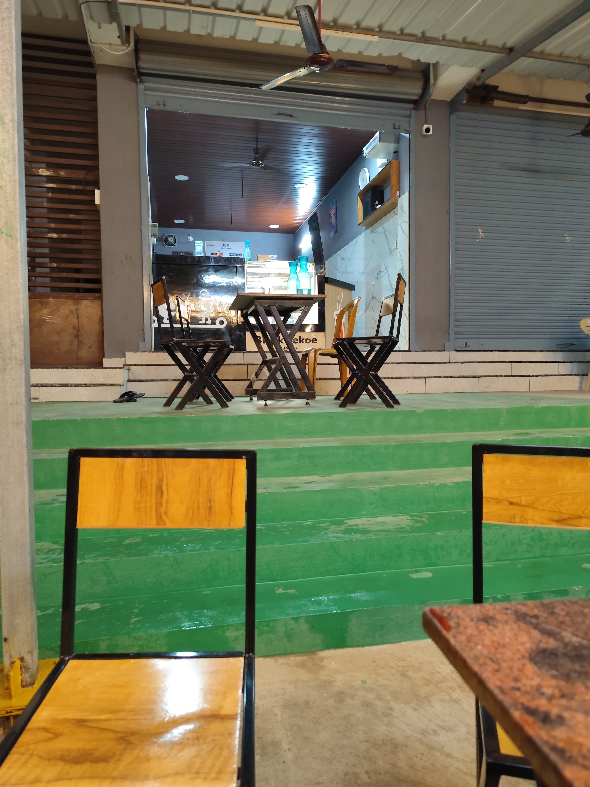 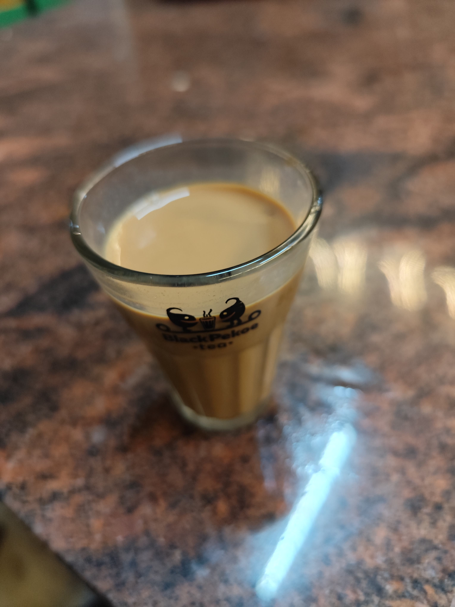

Our bus arrived, luckily in this we did not have a lot of crowd. We arrived at the foothill after ~15mins.

Once we got down, there were obviously small vendors selling packaged water bottles. We bought some of them. 

So there was still one problem. We weren't exactly at the foot of the hill, but around ~1km from the actuall entry to the hill. We had to go there via an [Auto Rickshaw](https://en.wikipedia.org/wiki/Auto_rickshaw). For some reason, foreigners call these "Tuk Tuk". Where did this word even originate from ? I've never seen someone here use this word.

## Here we go!

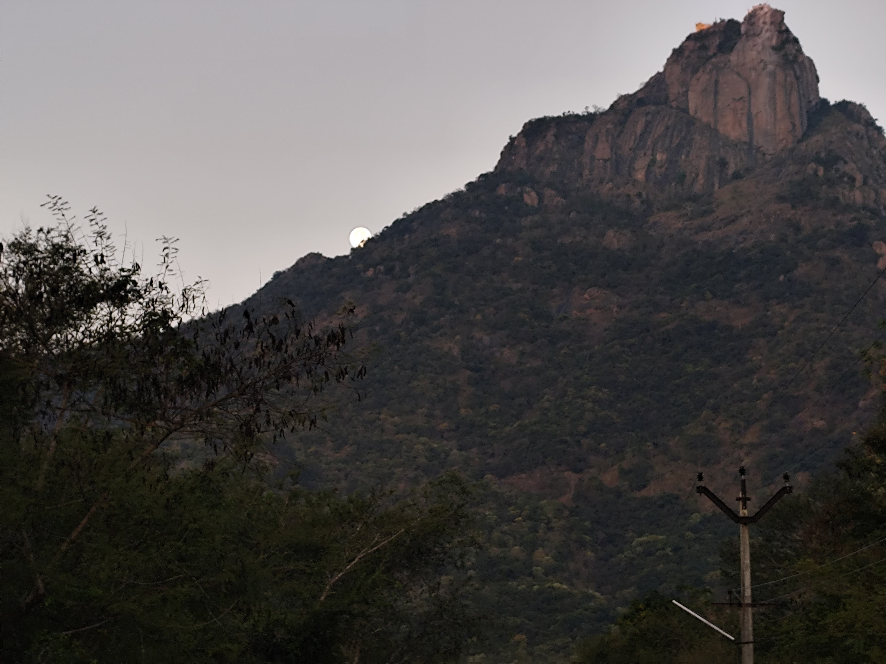
This is what we are climbing!!! Yes, that top!

We got to the foothill. We paid the entrace fee to get tickets for all of us. Now we had to walk for 10-15 mins to reach a checkpoint. Here checkpoints are either small temple like structures or small shops run my local vendors. These small vendors are present here n there during the entire stretch of the trek from the bottom to the top.

Found some monkeys at the first checkpoint! It's a beautiful small temple as well!

Smile, please! 😄

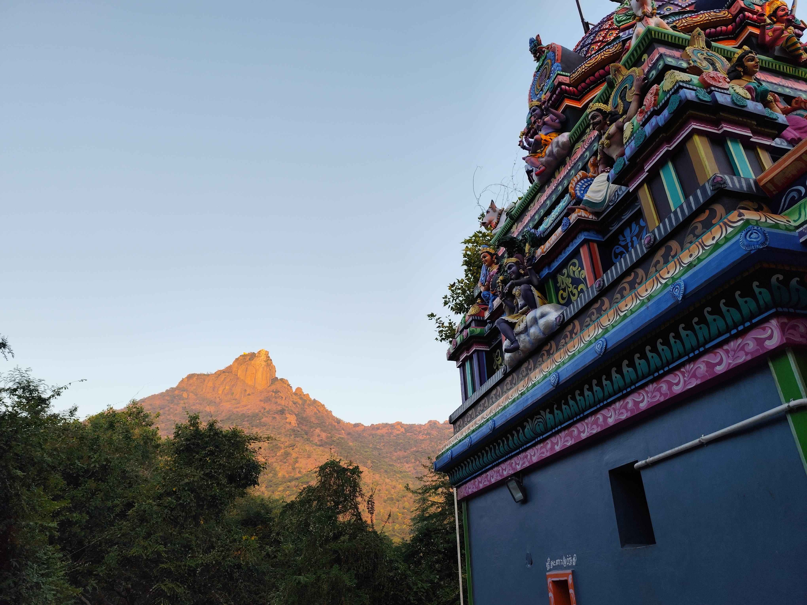

We rested like 10 mins here and continued on our way where we reached the steps. You might be thinking, "huh wait a sec, if there are steps, wouldn't this trek be very easy ?". Yes it would, atleast that's what I thought which turned out to be absolutely wrong. Very wrong!

I do not remember the exact amount of steps we had to climb, but it was well over a thousand. But each steps were marked with a number indicating how many steps we have crossed. Initially it was very easy, I even dashed through some people who went before us very quickly. But as time went on, I became tired quickly. I was able to feel my leg getting heavy and I was starting to struggle to lift my legs and at the same time sweating profusely. It was as if I had taken a bath. Because of this, I had to take short periods of rest here n there in the steps to catch my breath.

After ~1000 steps, the steps disappeared! 😱

There was only rocky paths left from there. Now this became challenging. There was one point while traversing these rocks, I became so tired, I just laid down on a big rock catching my breath. I became so tired I started to feel like throwing up. But luckily I didn't. I could feel my heartback in my face. It was as if someone or something inside me is looking for a way to escape. Like an egg getting ready to hatch. This is where I rested the longest (for 15-20 mins).

The views were nice tho!

 

As I said, these pictures barely justify what you can experience with your own eyes. These looked absolutely majestic and far away.

These rocky climbs were the hardest and the longest. I believe I spent like 2-2.5 hrs just on this! I had to rest and climb every now and then at this stage. After doing the cycle for a while, we reached a point, where we got another good view, but this time from a higher point.

The view was absolutely breath taking. (for someone who hasn't done something like this in a decade or so 🤓)

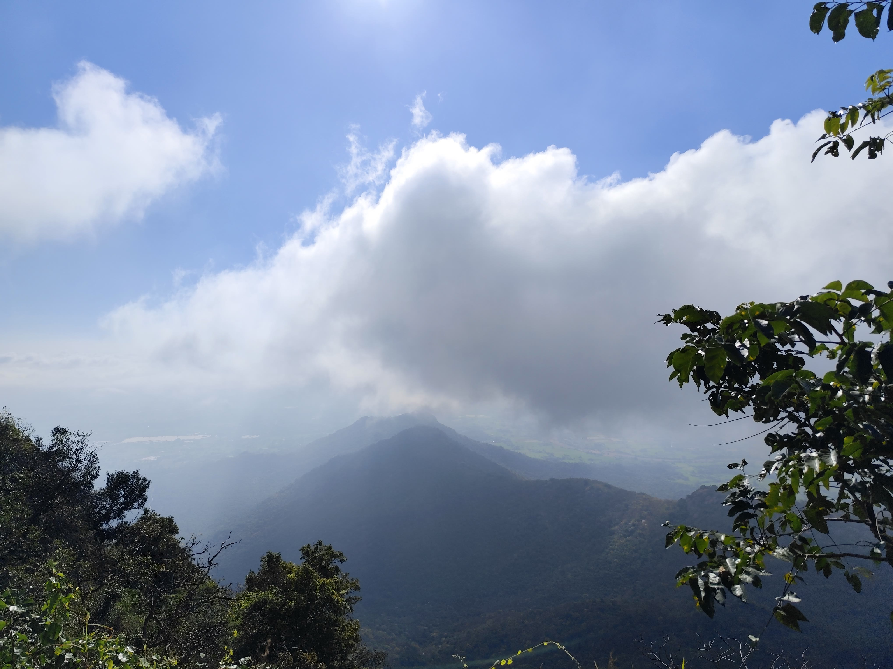

We continued to do the same for a while, then we reached the final phase of the climb. We have to climb the steepest part of the trek. it's essentially just a huge 60-90 metre single boulder and we have to climb it 70-80 degrees vertically.

Luckily, there are stairs to assists, otherwise no one would be able to do this.

I took this photo looking up at the sky. It's actually very steep and high. If you're climbing these metal shaky stairs, just make sure never to look down if you're afraid of height. But if you fall, it's GGs', absolute death, no chance of surviving. But the scene after this dangerous hurdle is worth it if you ask me.

There is one way to go up and another one to go down. Both of them are steep and very rattly metal staircases. There was a huge crowd lining up and queuing in the path that leads up.

What we did is, instead of waiting for hours, we just went up the stairs which was meant for people to go downwards from the top. Since there was no sign of anyone climbing down from that staircase. Climbing those stairs was thrilling! I'd say it was the most challenging part of this trek.

Once we climbed this, we had to trek some distance from where we could clearly see that we are nearing the top of the hill. Because there is actually a small temple at the top.

Here are some more cool pictures after climbing the steep part!

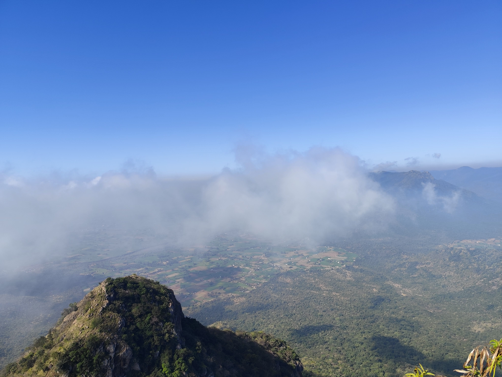
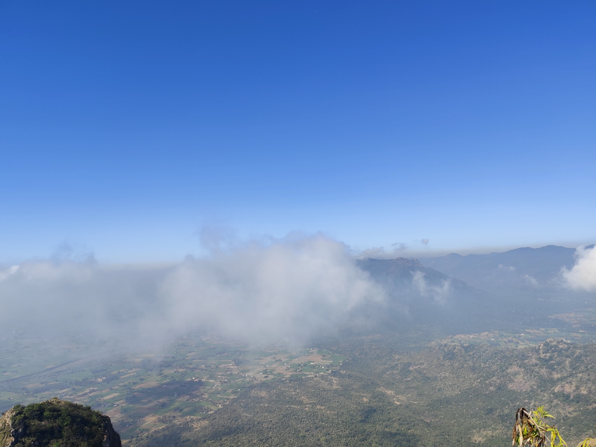
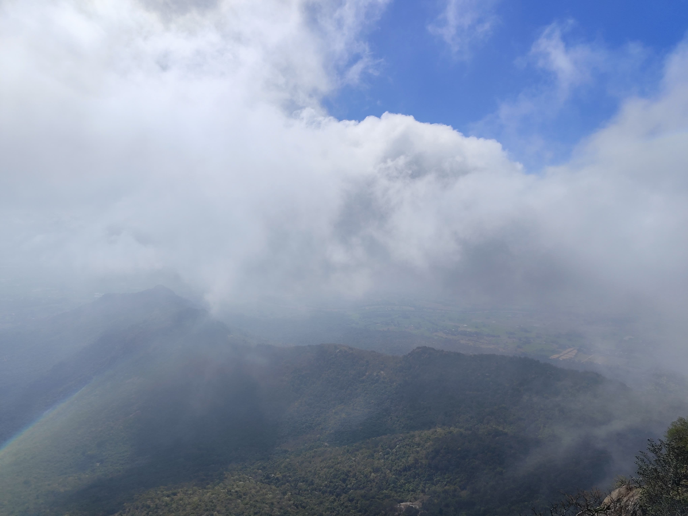
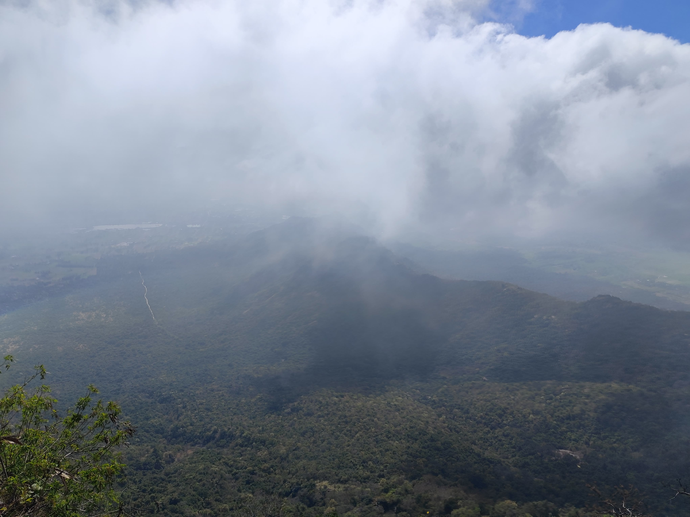

After a while, we were able to reach the top. The view looks great, I even saw some clouds going trough me. It was chilling after the trek. We started at the base at 6:00 and reached the top at 9:30-10:00. Based on what i've heard, this is the average time it takes for the trek.

We went inside the temple to see what's inside and just looked around took a lot of photos and was just enjoying the view most of the time.

Here are some pics from the top.

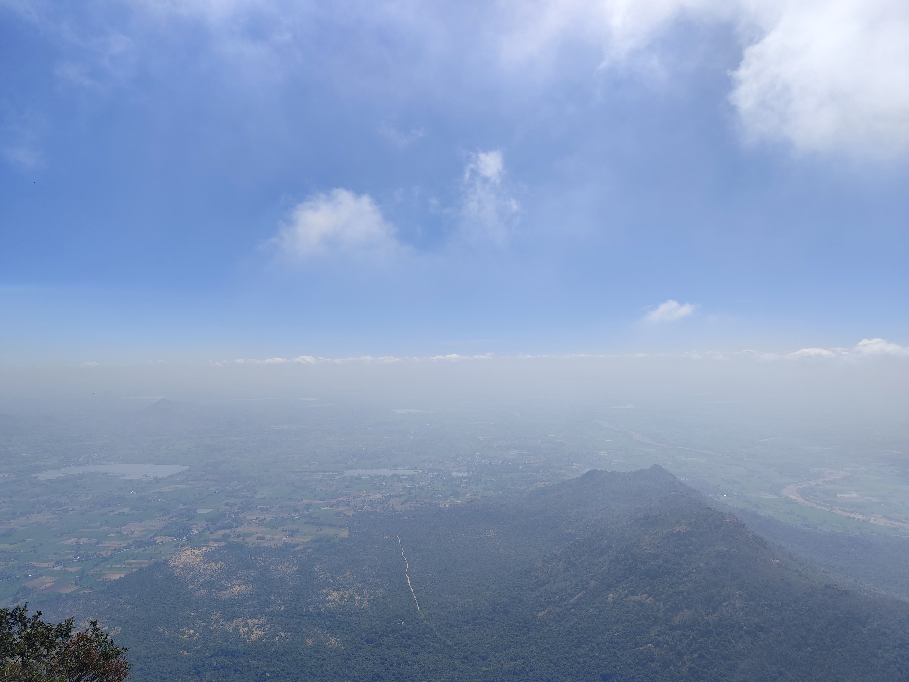
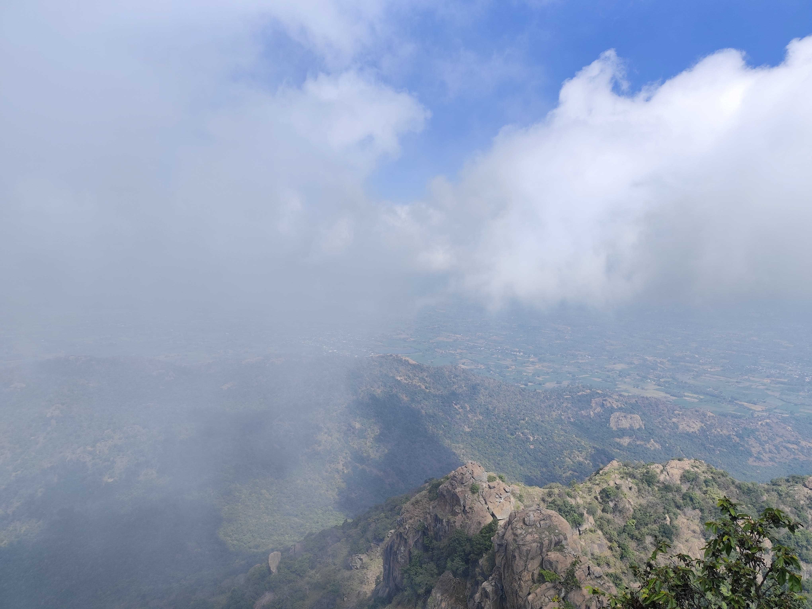
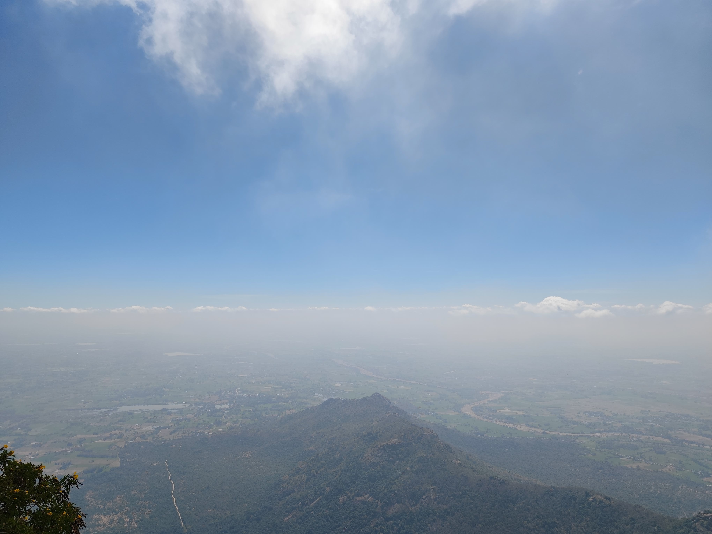

We decided to trek back down and followed the same path. Trekking down was much easier and faster, except for the climbing down part from the steep boulder. It was more scarier climbing down than climbing up. Once down, we dashed through the rocks like it was some parkour. After that we reached the steps and basically ran all the way in the steps, it was dangerous but the steps were large so it worked out.

Once we reached the foothill, we took an Auto Rickshaw and went to the nearest bus stop where we got on the bus to Tiruvannamalai back so that we can take a bus from there to our starting place.

Here are some pics that I took while travelling in the bus!

Once we got back in Tiruvannamalai, we went to one of my friend's home where we had a nice lunch. We stayed there for a while and went back to the bus stand for going back home. Again we travelled by bus all the way back. It was long hours but since we all were sleeping due to fatigue, we did not really notice what happened.

# End ?

This is the first time I've done something this physically intensive thing in a very long time. It was a challenging experience which was well worth the view I got at the top. Nothing feels rewarding more than pushing oneself to the utmost for something!

And I don't think I need to explain how I felt the next day when I woke up.

This article/blog hopefully will act as a defence or a proof that I can indeed "touch grass"!

