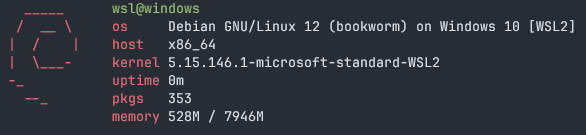

## `WSL2`

You guys already know what is `wsl2`, so let's not waste time. I assume at this point, you already have a distro for your WSL2 ready and don't know how to increase the RAM/memory.

For this example, I'll be using `Debian 12 (Bookworm)`.


### Powershell

Go to your `$HOME` directory in powershell. If you don't know what your HOME directory is, just do 
```powershell
echo $HOME
```
This would show you the home directory.

After this, we need to create a file called `.wslconfig` in the `$HOME` directory. We can do this from PowerShell itself.

```powershell
notepad.exe .wslconfig
```

### Notepad

A new Notepad window might open, in there just type

`.wslconfig`
```toml {linenos=true}
[wsl2]
memory=8GB
```

Now, for the `memory=` value, your value shouold be equal to or less than your actual Memory / RAM you have.

Lets say, I have 16 GB of RAM, then I can give 4 Gb, 8GB, 10GB, 16 GB etc.. as long as it is within or equal to 16 GB. 

Save the `.wslconfig` file in your `$HOME` directory.

Sometimes, it would be saved as `.wslconfig.txt`, you can rename it easily in PowerShell.
```powershell
mv .wslconfig.txt .wslconfig
```

### Restart your WSL2

After this, if your WSL2 is already running, restart it.
```powershell
wsl --shutdown
```

And now open, any distro you have.
```powershell
wsl -d Debian
```

Now check how much RAM/memory you have 😄

### Reference(s)
* https://learn.microsoft.com/en-us/windows/wsl/wsl-config